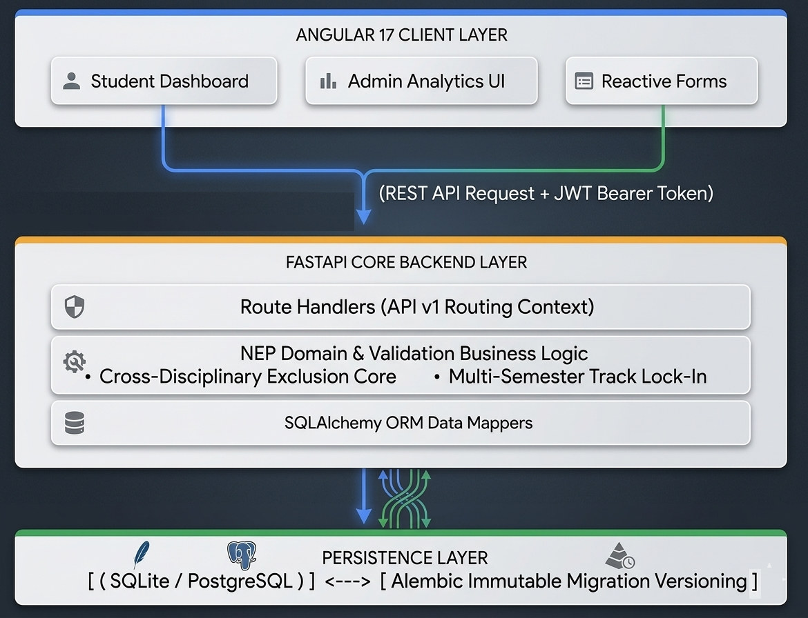

# MDM Smart Allocation System
## Developed by Yaaseen Basit.
> An enterprise-grade, collegiate ERP platform architected to manage Multidisciplinary Minor (MDM) preferences, structural track allocations, and compliance checks under the National Education Policy (NEP) framework. The platform automates student onboarding, enforces multi-semester prerequisite tracking, provides a reactive form state machine, and logs actions to an immutable administrative audit ledger.
---

## 📐 System Architecture & MDM Allocation Engine

The platform isolates clients and API resources to maximize throughput and guarantee predictable data consistency across the multi-stage preference lifecycle.

<p align="center">
  
</p>

---

## 🏗️ Tech Stack

| Layer | Technology |
|-------|-----------|
| Frontend | Angular 17, Angular Material, Chart.js, TypeScript |
| Backend | FastAPI, SQLAlchemy ORM, Pydantic v2, JWT Auth |
| Database | SQLite (dev) / PostgreSQL (prod) |
| Deployment | Vercel (frontend) + Render (backend) |

---

## ⚡ Local Setup — Backend

```bash
cd backend

# 1. Create virtual environment
python -m venv venv
source venv/bin/activate        # Windows: venv\Scripts\activate

# 2. Install dependencies
pip install -r requirements.txt

# 3. Copy environment file
cp .env.example .env
# Edit .env if needed (defaults work for local dev)

# 4. Run database migrations (optional - auto-runs on startup)
python -m alembic upgrade head

# 5. Start the server
uvicorn app.main:app --reload --port 8000
```

**Backend runs at:** http://localhost:8000  
**API Docs:** http://localhost:8000/api/docs  
**Database + seed data** are created automatically on first startup.

---

## ⚡ Local Setup — Frontend

```bash
cd frontend

# 1. Install dependencies
npm install --legacy-peer-deps

# 2. Start development server
npm start
# or
ng serve
```

**Frontend runs at:** http://localhost:4200

> Make sure backend is running on port 8000 before starting the frontend.

---

## 🗄️ Database Commands

```bash
cd backend

# Run all migrations
python -m alembic upgrade head

# Check current migration
python -m alembic current

# Generate new migration after model changes
python -m alembic revision --autogenerate -m "description"

# Rollback one migration
python -m alembic downgrade -1

# Reset to fresh DB (dev only)
rm mdm_system.db && python -m alembic upgrade head
```

---


## 📁 Project Structure

```
mdm-system/
├── backend/
│   ├── app/
│   │   ├── api/v1/          # FastAPI route handlers
│   │   │   ├── auth.py      # Login, register, refresh
│   │   │   ├── admin.py     # Admin CRUD + dashboard
│   │   │   └── student.py   # Student form workflow
│   │   ├── core/
│   │   │   ├── config.py    # Settings (env vars)
│   │   │   ├── database.py  # SQLAlchemy engine + session
│   │   │   ├── security.py  # JWT + bcrypt
│   │   │   └── deps.py      # FastAPI dependencies
│   │   ├── models/          # SQLAlchemy ORM models
│   │   ├── schemas/         # Pydantic request/response models
│   │   ├── services/        # Business logic (eligibility)
│   │   └── utils/seed.py    # Demo data seeder
│   ├── alembic/             # Database migrations
│   ├── requirements.txt
│   ├── render.yaml
│   └── .env
│
└── frontend/
    └── src/app/
        ├── auth/            # Login + Register pages
        ├── admin/           # Admin dashboard, forms, corrections, registry
        ├── student/         # Student dashboard, form, history
        └── shared/          # Services, guards, interceptors, models
```

---

## 🔑 Key Features

- **Registry-based verification** — Students can only register if their PRN exists in the admin-uploaded CSV
- **Reactive form workflow** — Draft → Submit → Review → Approve/Reject/Correction
- **Correction request workflow** — Admin requests changes; student resubmits; full diff tracked
- **Immutable audit trail** — Every action logged with old/new values, timestamp, actor
- **Branch eligibility** — Subject choices filtered by student's branch automatically
- **JWT authentication** — Separate admin and student auth flows with refresh tokens
- **Analytics dashboard** — Real-time metrics, charts, branch/preference distribution
- **CSV bulk upload** — Admin uploads registry roster; duplicates handled gracefully

---

## 🔧 API Endpoints

| Method | Path | Description |
|--------|------|-------------|
| POST | `/api/auth/admin-login` | Admin authentication |
| POST | `/api/auth/student-register` | Student registration (PRN verified) |
| POST | `/api/auth/student-login` | Student authentication |
| POST | `/api/admin/upload-registry` | Bulk CSV upload |
| GET | `/api/admin/forms` | All student forms |
| PUT | `/api/admin/update-form-status` | Approve/Reject/Correction |
| GET | `/api/admin/dashboard` | Analytics stats |
| GET | `/api/admin/correction-history` | Audit trail |
| GET | `/api/student/form` | Student's own form |
| POST | `/api/student/submit-form` | Submit form |
| PUT | `/api/student/resubmit-corrected-form` | Resubmit after correction |
| GET | `/api/student/history` | Student's audit history |

---

## 🎨 Brand Colors

| Name | Hex |
|------|-----|
| Primary Navy | `#002147` |
| Accent Cyan | `#00C2FF` |
| Success Green | `#00D68F` |
| Warning Gold | `#F5A623` |
| Danger Red | `#FF4757` |
| Alert Orange | `#FF6B35` |
